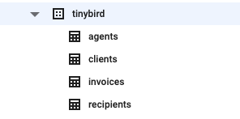

# Invoices data project

This data project demonstrates how [Tinybird](https://tinybird.co) could be used for real-time analytics retrieving data from BigQuery using the [CLI](https://docs.tinybird.co/cli.html) and an [Apache Beam connector](https://pypi.org/project/tinybird-beam/).

This project is divided into:  
- **ds-gen**: Python script for generating the source dataset used to populate BigQuery
- **tb-project**: The Tinybird data project
- **tableau-connector**: The "connectors" to consume Tinybird APIs from Tableau

Start by cloning this repo locally.
## Generate synthetic data

```bash
cd ds-gen
mkdir output
python3 -mvenv .e
source .e/bin/activate
pip install -r requirements.txt
python3 gen.py
```

## Upload data to BigQuery

You can just upload manually the generated JSON files in the previous step from [the BigQuery console](https://console.cloud.google.com/bigquery):

Create a dataset called `tinybird` and upload the JSON files using these table names:



## Upload the data project to Tinybird

```bash
cd tb-project
python3 -mvenv .e
source .e/bin/activate
pip install tinybird-cli
tb auth
tb push datasources/currency.datasource --fixtures
tb push --push-deps
```

## Import existing data from BigQuery to Tinybird

There's a BigQuery connector integrated in the CLI. To start using it run:

```bash
tb auth --connector bigquery
```

You'll be prompted by the name of your BigQuery project, the absolute path for a JSON service account with permissions to read/write from BigQuery and Storage, the name of a Storage bucket to store temporary files.

It supports several ingestion scenarios:

**Bulk upload**

This is handy to move data from BigQuery to Tinybird for the first time:

```bash
export PROJECT_ID="YOUR_PROJECT_ID"

tb datasource append agents \
                --connector bigquery \
                --sql "select agent_name, id from \`$PROJECT_ID.tinybird.agents\`"

tb datasource append clients \
                --connector bigquery \
                --sql "select company_country, company_name, id from \`$PROJECT_ID.tinybird.clients\`"

tb datasource append recipients \
                --connector bigquery \
                --sql "select recipient_country, recipient_code, id from \`$PROJECT_ID.tinybird.recipients\`"

tb datasource append invoices \
                --connector bigquery \
                --sql "select id, agent_id, recipient_code, client_id, amount, currency, created_at, to_json_string(added_payments) added_payments from \`$PROJECT_ID.tinybird.invoices\`"
```

**Incremental updates**

This is the kind of ingestion you want to schedule periodically (e.g. using a cron job), to ingest just the new data incoming to the `invoices` table.

```bash
tb datasource append invoices \
            --connector bigquery \
            --sql "select id, agent_id, recipient_code, client_id, amount, currency, created_at, to_json_string(added_payments) added_payments from \`$PROJECT_ID.tinybird.invoices\`" --incremental created_at
```

**Replacements**

The dimensions tables (agents, clients, recipients), can be fully replaced when you need to ingest new data:

```bash
tb datasource replace agents \
                --connector bigquery \
                --sql "select agent_name, id from \`$PROJECT_ID.tinybird.agents\`"
```

Or you can replace parts of data. For instance, to replace the invoices for the year 20201, run this:

```bash
tb datasource replace invoices \
            --connector bigquery \
            --sql "select id, agent_id, recipient_code, client_id, amount, currency, created_at, to_json_string(added_payments) added_payments from \`$PROJECT_ID.tinybird.invoices\` where date(created_at) > date('2021-01-01')" \
            --sql-condition="toDate(created_at) > toDate('2021-01-01')"
```

## Streaming with Google DataFlow

Create the Python environment:

```bash
git clone https://github.com/tinybirdco/tinybird-beam
cd tinybird-beam/dataflow
python3 -m venv env
source env/bin/activate
pip install -r requirements.txt
# Update the variables in the `sample.env` file and source it:
# TB_TOKEN should be the same token you used to push the data project in the previous steps
source sample.env
```

Create the PubSub topic:

```bash
gcloud pubsub topics create demo-topic
```

Push the Apache Beam pipeline to DataFlow:

```bash
python dataflow.py \
  --project=$PROJECT_NAME \
  --region=$REGION \
  --runner=DataflowRunner \
  --temp_location=$TMP_LOCATION \
  --input_topic=projects/$PROJECT_NAME/topics/$TOPIC \
  --bq_table=tinybird.invoices \
  --batch_size=10000 \
  --batch_seconds=5 \
  --batch_key= \
  --tb_host=https://api.tinybird.co \
  --tb_token=$TB_TOKEN \
  --tb_datasource=invoices \
  --tb_columns="id,agent_id,recipient_code,client_id,amount,currency,created_at,added_payments" --worker_machine_type=n1-highmem-32 --enable_streaming_engine --num_workers=1 --max_num_workers=5
```

This pipeline will batch 10000 elements or a window of 5 seconds to the Tinybird `invoices` Data Source.

Once running [check the job status](https://console.cloud.google.com/dataflow/jobs):


Start the PubSub publisher:

```
cd tinybird-beam/pubsub
python pubsub.py
```

Once you finish running the pipeline remember [cleaning resources](https://github.com/tinybirdco/tinybird-beam#clean-resources).

